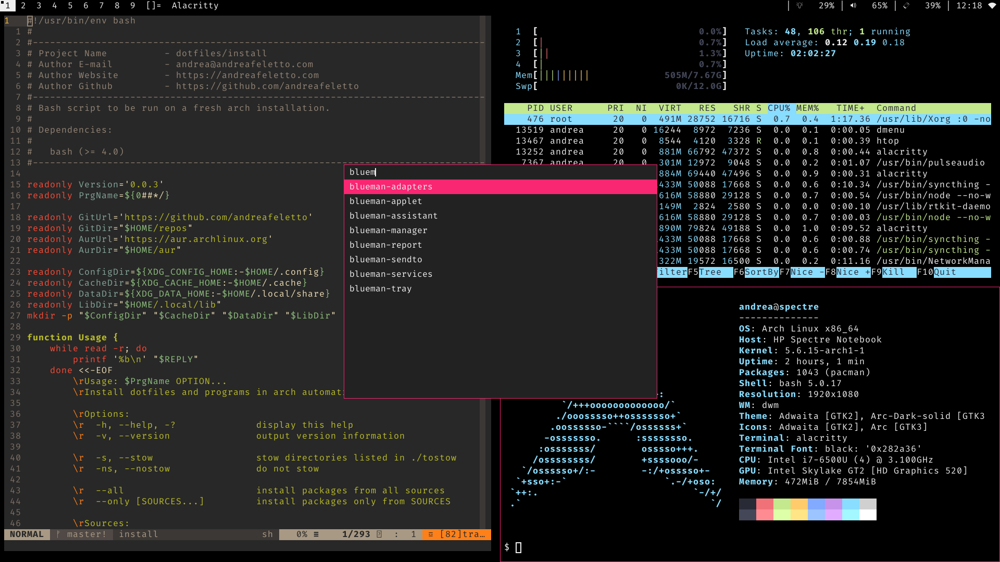

My Dotfiles
===========

Table of Contents
-----------------

<!-- vim-markdown-toc GFM -->

* [Screenshot](#screenshot)
* [Main Software](#main-software)
* [The `install` script](#the-install-script)
    * [Dependencies](#dependencies)
    * [Usage](#usage)
* [Major Scripts](#major-scripts)
    * [opass](#opass)
    * [status](#status)

<!-- vim-markdown-toc -->

Screenshot
----------



Main Software
-------------

| Type                    | Program          |
|-------------------------|------------------|
| Display Manager         | ly               |
| Window Manager          | dwm              |
| Terminal Emulator       | st               |
| Editor                  | neovim           |
| Browser                 | chromium         |
| App Launcher            | dmenu_run        |
| Hotkey Daemon           | sxhkd            |
| Network Manager         | networkmanager   |
| Notifications Daemon    | twmn             |
| Usb Auto-Mounting       | udiskie          |

The `install` script
--------------------

### Dependencies

- `bash`
- `git`
- `stow`

### Usage

Download the required dependencies:
```sh
sudo pacman -Syu bash git stow
```
Clone this repository into the home directory:
```sh
git clone https://github.com/andreafeletto/dotfiles.git
```
Move into the repository and run the install script:
```sh
cd dotfiles
./install --all --stow
```

Major Scripts
-------------

### opass

**Dependencies**: `op`, `dmenu`, `jq`, `xclip`

Wrapper for the 1Password cli tool `op` written in POSIX-compliant shell script.
Requires `dmenu` with the password patch applied.

### status

**Dependencies**: `xsetroot`, `pulseaudio`

Statusbar daemon for `dwm` written in POSIX-compliant shell script.
The bar updates automatically every 10 seconds and 
can be manually refreshed with a USR1 signal.

